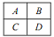

Прямоугольник  разбит  на  четыре маленьких  прямоугольника $A,B,C,D$. Среди чисел 3, 4, 5, 6, 7, 9, 11, 18 какие-то четыре выражают площади прямоугольников $A,B,C,D$. Найдите эту четверку чисел. 

