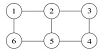
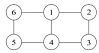

В кружочках расположены числа 1, 2, 3, 4, 5, 6. За один ход разрешается выбрать любую пару соседних (соединенных отрезком) чисел и прибавить к каждому из них одно и то же целое число (это число может меняться от шага к шагу). Можно ли из совокупности чисел на рис. 1 получить совокупность чисел, изображенных на рис. 2? 

 
&nbsp; &nbsp; &nbsp; &nbsp;

