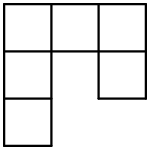

Назовем *крюком* фигуру, состоящую из шести единичных квадратов, как показано на рисунке ниже, а также любую фигуру, которую можно получить из нее с помощью поворотов и переворотов. Найдите все прямоугольники $m\times n$, которые можно замостить крюками. 

