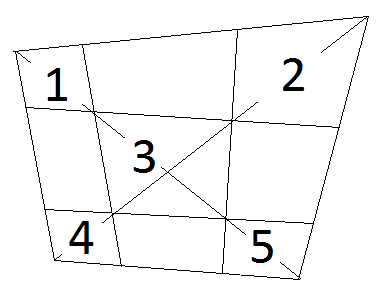

Выпуклый четырёхугольник поделен на девять четырехугольников четырьмя отрезками, точки пересечения которых лежат на диагоналях исходного четырехугольника (см. рисунок ниже). Известно, что в четырехугольники 1, 2, 3, 4 можно вписать окружности. Докажите, что в четырехугольник 5 также можно вписать окружность.
 

