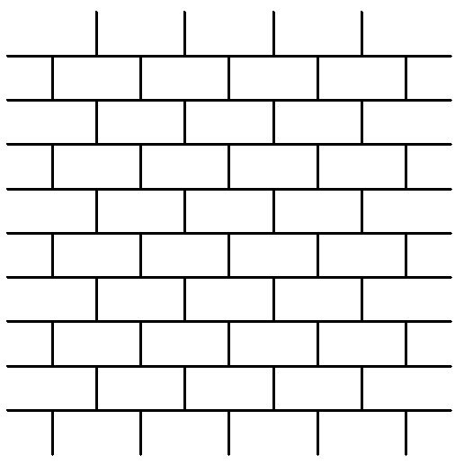

Можно ли сложить из кусков проволоки с длинами $1, 2, 3, \dots$ (каждая натуральная 
длина встречается ровно один раз) изображенную на рисунке бесконечную 
во всех направлениях "кирпичную 
стену"? (Проволоку можно сгибать; размер "кирпича" — $1\times 2$ ).

