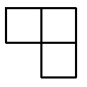

В клетках доски $n \times n$ расставлены нули и единицы. 
Во всех клетках левого столбца стоят единицы, и в каждой фигурке вида 

(состоящей из клетки и ее соседей слева и снизу) сумма чисел четна.
Докажите, что в таблице нет двух одинаковых строк.